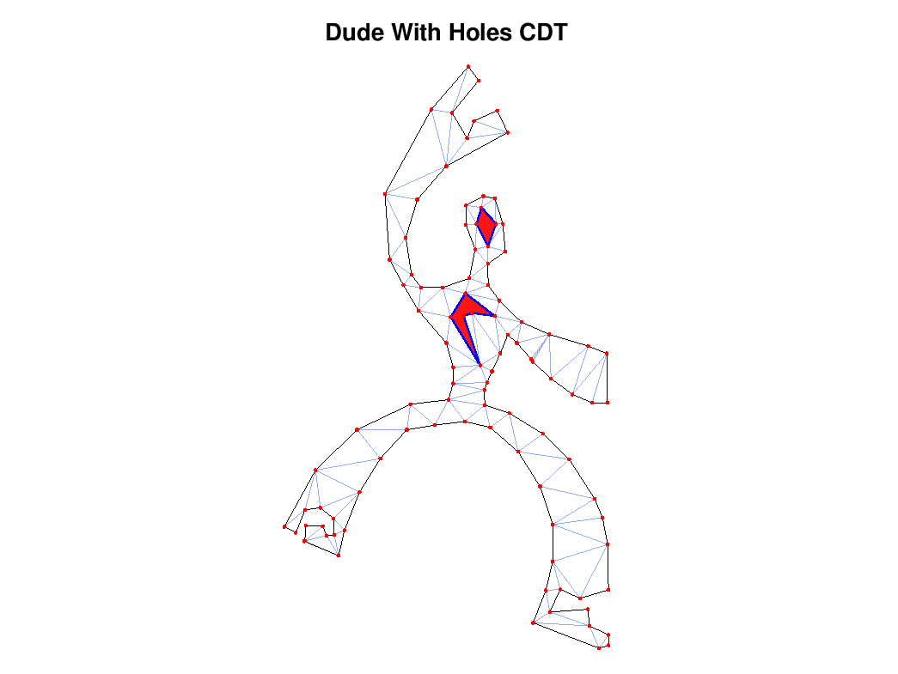

# octave-cdt

Constrained Delaunay Triangulation (CDT) for GNU Octave.



`octave-cdt` gives Octave a small polygon-oriented `cdt` function backed by
[`p2t`](https://github.com/greenm01/p2t)'s native CDT engine. The expensive
triangulation work runs in compiled code; Octave handles ordinary matrices in
and ordinary matrices out.

```octave
outer = [0 0; 1 0; 1 1; 0 1];
[tri, vertices] = cdt (outer);
triplot (tri, vertices(:, 1), vertices(:, 2));
axis equal;
```

Contours are closed for you. Do not repeat the first point at the end. Returned
triangle and edge indices are 1-based, as Octave users expect.

## Input

Pass the outer contour as an `N x 2` matrix:

```octave
outer = [0 0; 4 0; 4 4; 0 4];
[tri, vertices] = cdt (outer);
```

Add holes with a cell array:

```octave
hole = [1 1; 1 2; 2 2; 2 1];
[tri, vertices] = cdt (outer, {hole});
```

Or use the common Octave convention of `NaN NaN` rows to separate rings. The
first ring is the outer boundary; later rings are holes.

```octave
polygon = [outer; NaN NaN; hole];
[tri, vertices] = cdt (polygon);
```

Steiner points are optional:

```octave
steiner = [3 3];
[tri, vertices] = cdt (outer, {hole}, steiner);
```

Boundary edges are available when you ask for a third output:

```octave
[tri, vertices, boundary_edges] = cdt (outer, {hole}, [], ...
                                      struct ("keep_boundary_edges", true));
```

ADMESH-style domain masks are available through `cdt_points_in_domain`, which
accepts the same `PTS.Poly(k).x` / `PTS.Poly(k).y` structure used by ADMESH's
`PointsInDomain.m` helper:

```octave
PTS.Poly(1).x = [0; 4; 4; 0; 0];
PTS.Poly(1).y = [0; 0; 4; 4; 0];
PTS.Poly(2).x = [1; 1; 2; 2; 1];
PTS.Poly(2).y = [1; 2; 2; 1; 1];
IN = cdt_points_in_domain ([0.5; 1.5], [0.5; 1.5], PTS);
```

A thin `PointsInDomain` wrapper is also installed for ADMESH compatibility. Put
`octave-cdt/inst` before ADMESH's `12_In_Polygon` directory on Octave's path to
shadow ADMESH's MATLAB-only implementation without editing ADMESH itself.

`octave-cdt` also includes a small ADMESH-oriented MATLAB compatibility surface
for GNU Octave:

- `delaunayTriangulation(p)` and `delaunayTriangulation(p, C)`
- `pointLocation(dt, query)` and `isInterior(dt)`
- `griddedInterpolant` and `scatteredInterpolant` for 2-D query patterns
- `triangulation`, `freeBoundary`, `edgeAttachments`, and `edges`
- `KDTreeSearcher` and `knnsearch` with Euclidean distance
- `uiprogressdlg` as a headless no-op progress object

These shims are intentionally scoped to the call patterns ADMESH uses. They are
not complete MATLAB replacements.

## Build

You need Octave, `mkoctfile`, Nim, and a C/C++ toolchain. Build the
[`p2t`](https://github.com/greenm01/p2t) C ABI first:

```sh
cd ../p2t
nimble buildCAbi
```

Then build the Octave module:

```sh
cd ../octave-cdt
make
```

If `p2t` is somewhere else:

```sh
make P2T_DIR=/path/to/p2t
```

By default, the Makefile looks for the shared `p2t` library produced by the
current `p2t` nimble task:

- macOS: `/tmp/libp2t.dylib`
- Linux: `/tmp/libp2t.so`
- Windows: `/tmp/p2t.dll`

If your library is somewhere else, pass `P2T_LIB` and `P2T_LDFLAGS` explicitly:

```sh
make P2T_DIR=/path/to/p2t \
     P2T_LIB=/path/to/libp2t.so \
     P2T_LDFLAGS="-L/path/to -lp2t"
```

## Install

For a local Unix-style install:

```sh
make install PREFIX=$HOME/.local
```

Then load the package paths from Octave:

```octave
source (fullfile (getenv ("HOME"), ".local", "share", "octave-cdt", "cdt_setup.m"));
```

On Windows, install to any directory you control and source the generated
`cdt_setup.m` from Octave:

```octave
source ("C:/path/to/octave-cdt/cdt_setup.m");
```

Packaging notes for Homebrew are in
[packaging/homebrew](packaging/homebrew). Homebrew is only one distribution
path; it is not required by the library itself.

## Test

```sh
make test
```

## Examples

```sh
octave --path inst --path examples --path examples/fixtures --eval "demo_star"
octave --path inst --path examples --path examples/fixtures --eval "demo_polygon_with_hole"
octave --path inst --path examples --path examples/fixtures --eval "check_fixtures"
```

`demo_star` and `demo_polygon_with_hole` draw the triangulation. `check_fixtures`
runs the included fixtures without opening a graphics window.

## API

```octave
[tri, vertices] = cdt (outer)
[tri, vertices] = cdt (outer, holes)
[tri, vertices] = cdt (outer, holes, steiner)
[tri, vertices, boundary_edges] = cdt (outer, holes, steiner, options)
```

Arguments:

- `outer`: an `N x 2` numeric matrix, or a NaN-separated `N x 2` matrix whose first ring is the outer contour and whose later rings are holes.
- `holes`: a cell array of `N x 2` matrices, one `N x 2` matrix, a NaN-separated `N x 2` matrix, or `{}`.
- `steiner`: an `N x 2` numeric matrix, or `[]`.

Options:

- `epsilon`: geometric tolerance. Default: `1e-9`.
- `clean_input`: remove adjacent duplicates, a repeated closing point, and collinear contour points. Default: `true`.
- `validate`: validate contours before triangulation. Default: `true`.
- `keep_boundary_edges`: return boundary edges. Default: `nargout >= 3`.
- `mode`: `"checked"`, `"trusted"`, or `"normalized_trusted"`. Default: `"checked"`.
